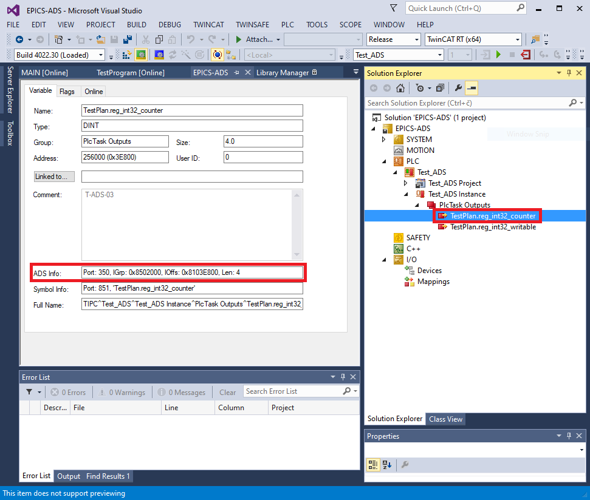

.. SPDX-FileCopyrightText: 2022 Cosylab d.d.
..
.. SPDX-License-Identifier: MIT

#########################
Overview
#########################
A working EPICS ADS device support system consists of the following components:

* :ref:`epics-base-ref`
* :ref:`asyndriver-ref`
* :ref:`beckhoff-adslib-ref`
* :ref:`autoparam-ref`
* :ref:`ads-driver-ref`
* :ref:`ads-sample-ref`

Software
########
This chapter briefly describes the software that constitutes the EPICS ADS device support.

.. _epics-base-ref:

EPICS Base
==========
*EPICS Base* (third party software) provides the tools, libraries and headers needed to compile and run the ADS device support library, as well as the ADS sample IOC.

Refer to the `EPICS website <https://epics.anl.gov>`_ for more information.

.. _asyndriver-ref:

asynDriver
==========
*AsynDriver* (third party software) is a general-purpose library for interfacing device specific code to low level drivers. It is used as a base by the autoparamDriver and the ADS port driver.

Refer to the `asynDriver website <https://epics.anl.gov/modules/soft/asyn/>`_ for more information.

.. _beckhoff-adslib-ref:

Beckhoff ADS client library
===========================
*Beckhoff ADS client library* implements the AMS/ADS protocol on top of TCP/IP. The library is used by the ADS port driver.

Refer to the `Beckhoff ADS website <https://github.com/Beckhoff/ADS>`_ for more information.

Also note, that this library is included in ADS driver as a submodule.

.. _ads-driver-ref:

ADS driver
===============
*ADS driver* implements the layer between the database records and the Beckhoff ADS client library. It exchanges data between input/output records and corresponding ADS variables.

`Github <https://www.github.com/cosylab/adsDriver>`_

.. _autoparam-ref:

AutoparamDriver
========================
*AutoparamDriver* is a library that simplifies integration of devices with lots of I/O signals of different types, which are handled in a similar way. The ADS port driver extends this library to keep track of which ADS addresses map to which database records in the IOC.

`Github <https://www.github.com/cosylab/autoparamDriver>`_

.. _ads-sample-ref:

Terminology
###########

The term *register* is used to describe an address on the ADS service, which corresponds to a specific I/O terminal's input or output channel raw value or a PLC program variable. For example, a variable can have an address specification such as this: ``Port: 300, IGrp: 0x0x8502000, IOffs: 0x8103E800, Len: 4``. See figure below for example.

The term *variable* or *symbolic name* is used to describe a named data block in the memory of the program running on the ADS server. Each variable has a specified size and type (e.g. INT, UINT, FLOAT, array of BOOL, etc.). An example variable name can be ``MAIN.input_temperature``, where the first part ``MAIN`` represents the name of the running program (in this case the PLC main program) and the second part, i.e. ``input_temperature``, the name of the variable used in that PLC program. Depending on the PLC program, variables can either be linked to physical I/O terminals (e.g. to a specific 0..10 V analog input channel connected to a temperature sensor), or they can be logical – derived from I/O channels (e.g. converted raw input value from temperature sensor to degrees Celsius), or representing some internal state (e.g. program running cycle counter).

Note that with ADS, both registers and variables are finally accessed in the same way: using the port, group, offset and length specifiers. The difference is that for variables, the symbolic name is first dereferenced into an ADS group and offset specifiers (further referenced in this document as *handle*).

   Example ADS address information for PLC variable "TestPlan.reg_int32_counter"

