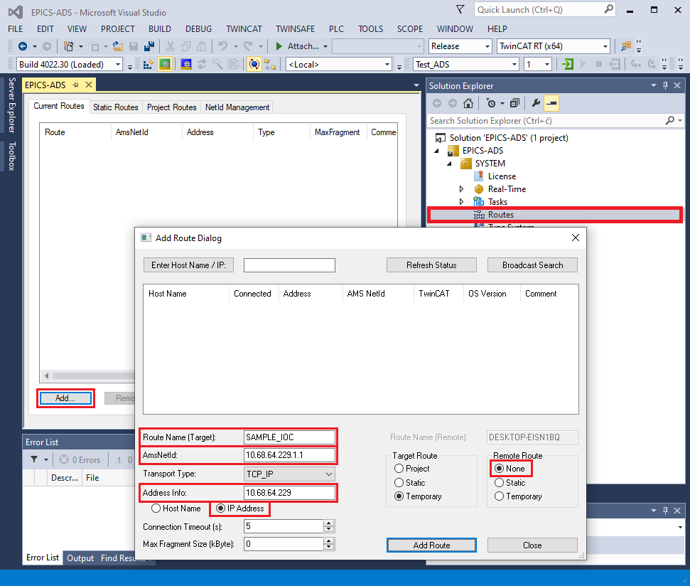
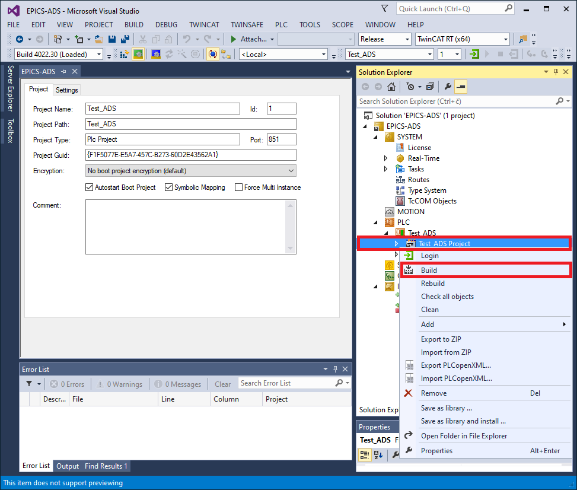
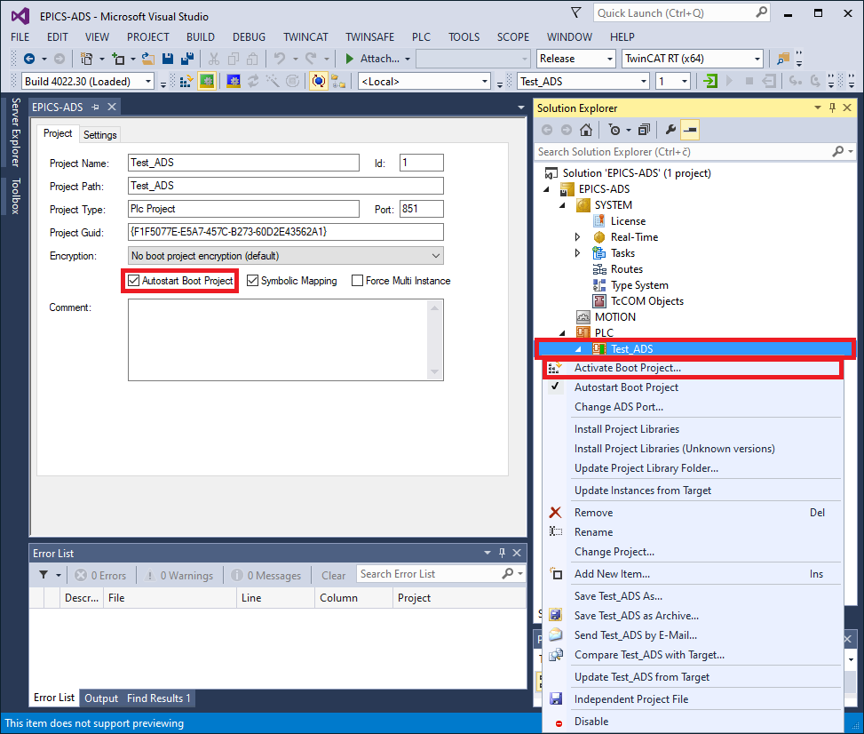

.. SPDX-FileCopyrightText: 2022 Cosylab d.d.
..
.. SPDX-License-Identifier: MIT

###############
Using EPICS ADS
###############

:ref:`using-ads-sample` describes how to compile and run *ADS sample IOC*, which is provided as a reference implementation with the ADS device support library. :ref:`using-new-ioc` describes how to include ADS device support in a new IOC.

.. _using-ads-sample:

ADS Example IOC
===============
*ADS example IOC* is provided as a reference IOC implementation with the ADS device support library. To successfully run the IOC, a connection with the PLC program running in TwinCAT XAE must be set up.

The example IOC is included as an EPICS application and is located in your *$TOP/adsExampleApp/*. This IOC contains the necessary records that connect to the variables of the example PLC program.

.. _using-twincat-setup:

TwinCAT XAE
-----------
The PLC program can be found in the TC3_testProj directory in the **ads-sample-ioc** directory. This program can be used in conjunction with the ADS example IOC.

Configure ADS route
^^^^^^^^^^^^^^^^^^^
First, open the project in TwinCAT XAE, click ``SYSTEM -> Routes``, then click the *Add* button. Fill in route parameters:

* **Route name**: Descriptive name of the new route.
* **AmsNetId**: AMS net ID of the IOC that will connect to the PLC program.
* **Address info**: IP address of the IOC that will connect to the PLC program (i.e., IP of the host OS running the IOC).
* **Host name/IP address**: Select *IP address* to match the above *Address info* specification.
* **Remote route**: Set to None.

   Example of add route dialog

Building PLC project
^^^^^^^^^^^^^^^^^^^^
Next, right click on ``Test_ADS Project``, then click *Build* to build the project.

   Building a TwinCAT project in XAE

Activating PLC project and Autostart
^^^^^^^^^^^^^^^^^^^^^^^^^^^^^^^^^^^^
Assuming that the program compiled without errors, click on the ``Test-ADS`` and make sure that *Autostart Boot Project* is checked. Then right click on ``Test_ADS`` again and click *Activate Boot Project*.

   Activating a TwinCAT project in XAE

Activating Configuration
^^^^^^^^^^^^^^^^^^^^^^^^
The last step is to activate the configuration by clicking ``TwinCAT -> Activate Configuration``. Make sure that the PLC in in *Run mode* before connecting to the PLC with the IOC.

.. _using-install-sample:

Using the Sample IOC
-------------------------
Configuring st.cmd
^^^^^^^^^^^^^^^^^^

Two things need to be edited in *st.cmd*:

1. Change the *local AMS net ID*. This can be the same as the local IP address, with an additional “.1.1” suffix, e.g. 10.68.64.229.1.1). This local (IOC) AMS ID and IP address must be added as a route as described in :ref:`TwinCAT section of this chapter <using-twincat-setup>`.

2. Set the connection parameters for the host running the *Test plan project* PLC program:

   * **IP_TEST_PLAN**: IP address
   * **AMS_ID_TEST_PLAN**: AMS net ID

.. code-block::
   :caption: Example st.cmd
   :emphasize-lines: 9,15,16

   #!../../bin/linux-x86_64/adsExample
   
   ## Register all support components
   dbLoadDatabase "../../dbd/adsExample.dbd"
   ads_sample_registerRecordDeviceDriver pdbbase
   
   
   # Set local AMS net ID
   AdsSetLocalAMSNetID("10.68.64.229.1.1")
   
   
   # Test Plan PLC program connection parameters
   epicsEnvSet("PREFIX_ADSEXAMPLE", "ADS-EXAMPLE-01")
   epicsEnvSet("PORT_ADSEXAMPLE", "ads-example-port")
   epicsEnvSet("IP_ADSEXAMPLE", "10.68.6.45")
   epicsEnvSet("AMS_ID_ADSEXAMPLE", "10.68.79.25.1.1")
   
   
   # Load record instances for Test Plan PLC program
   dbLoadRecords("../../db/example.db","P=$(PREFIX_ADSEXAMPLE), PORT=$(PORT_ADSEXAMPLE)")
   
   # Open ADS port
   AdsOpen("$(PORT_ADSEXAMPLE)", "$(IP_ADSEXAMPLE)", "$(AMS_ID_ADSEXAMPLE)")
   
   # Enable asyn trace output for errors and warnings
   asynSetTraceMask("$(PORT_TEST_PLAN)", 0, 0x21)
   # Alternatively, output everything
   #asynSetTraceMask("$(PORT_TEST_PLAN)", 0, 0xff)
   
   iocInit
   # End of IOC initialization

Running Sample IOC
^^^^^^^^^^^^^^^^^^

Now that the simulated PLC is running in the TwinCAT XAE and the st.cmd is configured, the IOC can be started:

.. code-block:: console
                
   $ cd iocBoot/iocadsExample/
   $ ../../bin/linux-x86_64/adsExample st.cmd
   ## Register all support components
   dbLoadDatabase "dbd/adsExample.dbd"
   adsExample_registerRecordDeviceDriver pdbbase
   # Set local AMS net ID
   AdsSetLocalAMSNetID("192.168.122.75.1.1")
   # example PLC program connection parameters
   epicsEnvSet("PREFIX_ADSEXAMPLE", "ADS-EXAMPLE-01")
   epicsEnvSet("PORT_ADSEXAMPLE", "ads-example-port")
   epicsEnvSet("IP_ADSEXAMPLE", "192.168.122.146")
   epicsEnvSet("AMS_ID_ADSEXAMPLE", "10.0.2.15.1.1")
   ## Load record instances
   dbLoadRecords("db/example.db","P=ADS-EXAMPLE-01, PORT=ads-example-port")
   # Open ADS port
   AdsOpen("ads-example-port", "192.168.122.146", "10.0.2.15.1.1")
   [TRACE] ADSPortDriver.cpp:178 ADSPortDriver(): ADSPortDriver parameters: ads-example-port, 192.168.122.146, 10.0.2.15.1.1, 500, -1
   [TRACE] ADSPortDriver.cpp:180 ADSPortDriver(): ADSPortDriver instance: 0x9464b0, ip: 192.168.122.146
   # Enable asyn trace output for errors and warnings
   asynSetTraceMask("ads-example-port", 0, 0x21)
   # Alternatively, output everything
   #asynSetTraceMask("$(PORT_ADSEXAMPLE)", 0, 0xff)
   cd "/opt/epics/modules/ads-3.0.0/iocBoot/iocadsExample"
   iocInit
   Starting iocInit
   ############################################################################
   ## EPICS R7.0.4.1
   ## Rev. 2022-05-05T17:02+0200
   ############################################################################
   [TRACE] ADSPortDriver.cpp:202 initHook(): ADSPortDriver instance: 0x9464b0, ip: 192.168.122.146
   [TRACE] ADSPortDriver.cpp:232 connect(): ADSPortDriver instance: 0x9464b0, ip: 192.168.122.146
   2022-06-13T14:52:42+0200 Info: Connected to 192.168.122.146
   2022/06/13 14:52:42.050 [WARNING] ADSPortDriver.cpp:259 connect(): [ads-example-port] Connected to ADS device (IP: 192.168.122.146)
   2022/06/13 14:52:42.050 [WARNING] ADSPortDriver.cpp:264 connect(): [ads-example-port] Resolving ADS variable names
   iocRun: All initialization complete
   ## Start any sequence programs
   #seq sncxxx,"user=vagrant"
   epics> 2022/06/13 14:52:53.445 [WARNING] ADSPortDriver.cpp:291 connect(): [ads-example-port] Resolved 10016 read and 16 write variable names
   2022/06/13 14:52:53.446 [WARNING] ADSPortDriver.cpp:305 connect(): [ads-example-port] Initialized sum-read request buffers
   2022/06/13 14:52:53.496 [WARNING] ADSPortDriver.cpp:308 connect(): [ads-example-port] Inital sum-read status (0): OK
   
   epics> 

Refer to the :ref:`heading-troubleshooting` section if the IOC fails to connect to the ADS devices.

.. note::
   Exiting the IOC using *exit* command (or *ctrl-d*) may output errors describing the port being disabled. This is normal behavior. EPICS scan threads continue to work
   even after exit hooks are called, which can result in device support locking the non-existent driver. To prevent issues from that, port driver is disabled at IOC exit. 

.. note::
   The *ads-sample-ioc* repository contains GUI screens for the simulated PLC (``adsExampleApp/exampleScreens/adsExample.bob``) which can be open in *Phoebus*.

.. _using-new-ioc:

ADS Device Support in a New IOC
===============================

This example shows how to create a new IOC with the ADS device support included. For this example, create a new IOC using ``makeBaseApp.pl``:

.. code-block:: console

   $ mkdir test-ioc
   $ cd test-ioc/
   $ makeBaseApp.pl -t ioc test
   $ makeBaseApp.pl -i -t ioc test
   Using target architecture linux-x86_64 (only one available)
   The following applications are available:
   test
   What application should the IOC(s) boot?
   The default uses the IOC's name, even if not listed above.
   Application name? test

Which should produce a directory structure similar to this:

.. code-block:: console

   $ ls -R
   .:
   configure  iocBoot  Makefile  testApp
   
   ./configure:
   CONFIG  CONFIG_SITE  Makefile  RELEASE  RULES  RULES_DIRS  RULES.ioc  RULES_TOP
   
   ./iocBoot:
   ioctest  Makefile
   
   ./iocBoot/ioctest:
   Makefile  st.cmd
   
   ./testApp:
   Db  Makefile  src
   
   ./testApp/Db:
   Makefile
   
   ./testApp/src:
   Makefile  testMain.cpp

Now add the required ADS EPICS modules to the ``configure/RELEASE`` file: *ASYN* and *ADS*. It is not necessary to set the *AUTOPARAM* module path, since it is linked with the ADS port driver library. Also, because the IOC was created using ``makeBaseApp.pl``, the *EPICS_BASE* should already be pointing to the correct location:

.. code-block:: console
   :emphasize-lines: 6,7,13

   # RELEASE - Location of external support modules
   ...
   # Variables and paths to dependent modules:
   #MODULES = /path/to/modules
   #MYMODULE = $(MODULES)/my-module
   ASYN = /opt/epics/modules/asyn
   ADS = /opt/epics/modules/ads
   
   # If using the sequencer, point SNCSEQ at its top directory:
   #SNCSEQ = $(MODULES)/seq-ver
   
   # EPICS_BASE should appear last so earlier modules can override stuff:
   EPICS_BASE = /opt/epics/base
   
   # Set RULES here if you want to use build rules from somewhere
   # other than EPICS_BASE:
   ...
   
Edit the IOC's ``src/Makefile`` and include *asynDriver* and *ADS driver*'s DBD and library files. It is **not** necessary to include DBD and library files from the *autoparamDriver* module.

.. code-block:: makefile
   :emphasize-lines: 20,24

   TOP=../..

   include $(TOP)/configure/CONFIG
   #----------------------------------------
   #  ADD MACRO DEFINITIONS AFTER THIS LINE
   #=============================
   
   #=============================
   # Build the IOC application

   PROD_IOC = test
   # test.dbd will be created and installed
   DBD += test.dbd
   
   # test.dbd will be made up from these files:
   test_DBD += base.dbd
   
   # Include dbd files from all support applications:
   #test_DBD += xxx.dbd
   test_DBD += asyn.dbd ads.dbd
   
   # Add all the support libraries needed by this IOC
   #test_LIBS += xxx
   test_LIBS += asyn ads
   
   # test_registerRecordDeviceDriver.cpp derives from test.dbd
   test_SRCS += test_registerRecordDeviceDriver.cpp
   
   # Build the main IOC entry point on workstation OSs.
   test_SRCS_DEFAULT += testMain.cpp
   test_SRCS_vxWorks += -nil-
   
   # Add support from base/src/vxWorks if needed
   #test_OBJS_vxWorks += $(EPICS_BASE_BIN)/vxComLibrary
   
   # Finally link to the EPICS Base libraries
   test_LIBS += $(EPICS_BASE_IOC_LIBS)
   
   #===========================
   
   include $(TOP)/configure/RULES
   #----------------------------------------
   #  ADD RULES AFTER THIS LINE
   
Compile the IOC:

.. code-block:: console

   $ make
   make -C ./configure install 
   make[1]: Entering directory `/home/epics-dev/test-ioc/configure'
   perl -CSD /opt/epics/base/bin/linux-x86_64/makeMakefile.pl O.linux-x86_64 ../..
   mkdir O.Common
   make -C O.linux-x86_64 -f ../Makefile TOP=../.. \
   T_A=linux-x86_64 install

   ... <output removed for brevity>

   make -C ./iocBoot install 
   make[1]: Entering directory `/home/epics-dev/test-ioc/iocBoot'
   make -C ./ioctest install 
   make[2]: Entering directory `/home/epics-dev/test-ioc/iocBoot/ioctest'
   perl -CSD /opt/epics/base/bin/linux-x86_64/convertRelease.pl -t /home/epics-dev/test-ioc envPaths
   make[2]: Leaving directory `/home/epics-dev/test-ioc/iocBoot/ioctest'
   make[1]: Leaving directory `/home/epics-dev/test-ioc/iocBoot'

Assuming the compilation step was successful, you can run the IOC and check if ADS port driver commands are available in the IOC shell:

.. code-block:: console

   $ cd iocBoot/ioctest/
   $ ../../bin/linux-x86_64-debug/test st.cmd
   #!../../bin/linux-x86_64/test
   ## You may have to change test to something else
   ## everywhere it appears in this file
   < envPaths
   epicsEnvSet("IOC","ioctest")
   epicsEnvSet("TOP","/home/epics-dev/test-ioc")
   epicsEnvSet("ASYN","/opt/epics/modules/asyn")
   epicsEnvSet("ADS","/opt/epics/modules/ads")
   epicsEnvSet("EPICS_BASE","/opt/epics/base")
   cd "/home/epics-dev/test-ioc"
   ## Register all support components
   dbLoadDatabase "dbd/test.dbd"
   test_registerRecordDeviceDriver pdbbase
   ## Load record instances
   #dbLoadRecords("db/xxx.db","user=andrej")
   cd "/home/epics-dev/test-ioc/iocBoot/ioctest"
   iocInit
   Starting iocInit
   ############################################################################
   ## EPICS R3.15.5
   ## EPICS Base built Aug 31 2018
   ############################################################################
   iocRun: All initialization complete
   ## Start any sequence programs
   #seq sncxxx,"user=andrej"

Run ``help`` command and verify that the ADS port driver commands are available, i.e. ``AdsOpen`` and ``AdsSetLocalAMDSNetID``:

.. code-block::

   epics> help
   Type 'help <command>' to see the arguments of <command>.
                  AdsFindIOIntrRecord             AdsOpen         
   AdsSetLocalAMSNetID             ClockTime_Report                
   ClockTime_Shutdown              asDumpHash      asInit          asSetFilename
   asSetSubstitutions              ascar           asdbdump        asphag
   aspmem          asprules        aspuag          astac           
   asynAutoConnect asynEnable      asynInterposeEosConfig          
   asynInterposeFlushConfig        asynOctetConnect                
   asynOctetDisconnect             asynOctetFlush  asynOctetGetInputEos

   ... <output removed for brevity>

You now have a functional IOC that can use the ADS protocol to communicate with ADS capable devices. What is missing is a functional database with record configuration for the ADS device that you are connecting to the IOC, and an open ADS connection between them.

Refer to the ADS example IOC sources to see an example how the EPICS database is configured and how to open an ADS client connection from the IOC to an ADS device. Refer to :ref:`heading-ref-manual` for record configuration and IOC command description.

